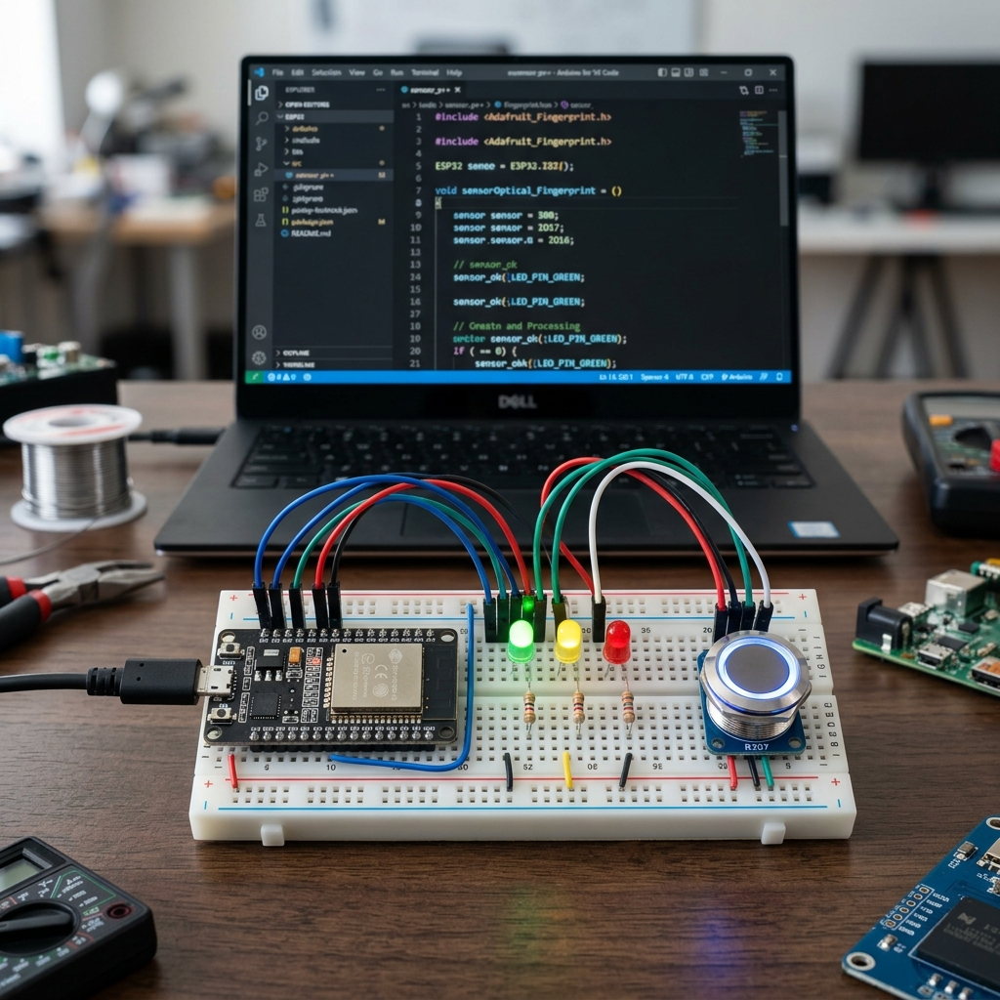

<div align="center">

  

  # 🔐 AuthIntegrate

  **The Ultimate Fusion of Biometrics, Real-time IoT, and Modern Web Security.**

  [](https://auth-integrate.vercel.app)
  [](https://vitejs.dev/)
  [](https://reactjs.org/)
  [](https://tailwindcss.com/)
  [](https://nodejs.org/)
  [](https://orm.drizzle.team/)
  [](https://www.postgresql.org/)

  [Explore Docs](#-getting-started) • [Live Demo](https://auth-integrate.vercel.app) • [Report Bug](https://github.com/Suyog-Repal/AuthIntegrate/issues)

</div>

---

## 🌟 Overview

**AuthIntegrate** is a state-of-the-art authentication ecosystem that bridges the gap between digital security and physical hardware. It combines a sleek, modern React frontend with a robust Express backend and real-time IoT integration using ESP32 and biometric sensors.

Whether you're securing a web app or an entire physical office, AuthIntegrate provides the tools to manage users, monitor hardware events in real-time, and generate comprehensive security reports.

---

## ✨ Key Features

- **🛡️ Secure Authentication**: JWT-based auth with high-entropy password hashing (Bcrypt).
- **📟 Biometric Integration**: Seamless connection with ESP32 and Fingerprint sensors for physical access control.
- **⚡ Real-time Synchronization**: Instant hardware event updates via Socket.IO.
- **📊 Advanced Analytics**: Interactive dashboards with Recharts for visualizing access logs.
- **📄 Report Generation**: Export detailed access logs and user activities to PDF and Excel.
- **📧 Smart Notifications**: Automated transactional emails using Resend and Nodemailer.
- **🎨 Premium UI/UX**: A gorgeous, responsive interface built with Shadcn/UI, Tailwind CSS, and Framer Motion.
- **🏗️ Production Ready**: Fully optimized for deployment on Vercel (Frontend) and Render (Backend).

---

## 🛠️ Tech Stack

### Frontend
- **Framework**: React 18 (Vite)
- **Styling**: Tailwind CSS + Shadcn/UI
- **State Management**: TanStack Query (React Query)
- **Animations**: Framer Motion
- **Charts**: Recharts
- **Communication**: Socket.io-client & Axios
- **Form Handling**: React Hook Form + Zod

### Backend
- **Runtime**: Node.js (TypeScript)
- **Framework**: Express.js
- **ORM**: Drizzle ORM
- **Database**: PostgreSQL (Supabase)
- **Real-time**: Socket.io
- **Emailing**: Resend & Nodemailer
- **Reports**: jsPDF & SheetJS (XLSX)

### Hardware
- **Controller**: ESP32
- **Sensor**: AS608 Fingerprint Module
- **Protocol**: HTTP/HTTPS + WebSockets

---

## 📸 Project Preview

<div align="center">
  <h3>🖥️ Web Dashboard</h3>
  
  
  <br/>
  
  <h3>🔌 Hardware Setup</h3>
  
  <p><i>The hardware setup consists of an ESP32 microcontroller, a fingerprint sensor, and indicator LEDs.</i></p>
</div>

---

## 🏗️ Project Structure

```bash
AuthIntegrate/
├── backend/         # Node.js + Express + Drizzle ORM (API & Socket Server)
├── frontend/        # React + Vite + Tailwind (Web Interface)
├── hardware/        # C++/Arduino code for ESP32 & Fingerprint Sensor
└── README.md
```

---

## 🚀 Getting Started

### 1. Clone the repository
```bash
git clone https://github.com/Suyog-Repal/AuthIntegrate.git
cd AuthIntegrate
```

### 2. Backend Setup
```bash
cd backend
npm install
# Configure your .env file (see below)
npm run db:push
npm run dev
```

### 3. Frontend Setup
```bash
cd ../frontend
npm install
# Configure your .env file (see below)
npm run dev
```

---

## ⚙️ Environment Configuration

### Backend (`backend/.env`)
| Variable | Description |
| :--- | :--- |
| `DATABASE_URL` | PostgreSQL connection string (Supabase) |
| `JWT_SECRET` | Secret key for JWT signing |
| `RESEND_API_KEY` | API key for Resend email service |
| `FRONTEND_URL` | URL of the frontend (for CORS) |
| `PORT` | Port for the backend server (default: 5000) |

### Frontend (`frontend/.env`)
| Variable | Description |
| :--- | :--- |
| `VITE_API_URL` | Base URL of the Backend API |
| `VITE_SOCKET_URL` | URL of the Backend Socket server |

---

## 📜 License

Distributed under the MIT License. See `LICENSE` for more information.

---

<div align="center">
  <p>Built with ❤️ by <b>Suyog Repal</b></p>
  <a href="https://github.com/Suyog-Repal">
    
  </a>
</div>
